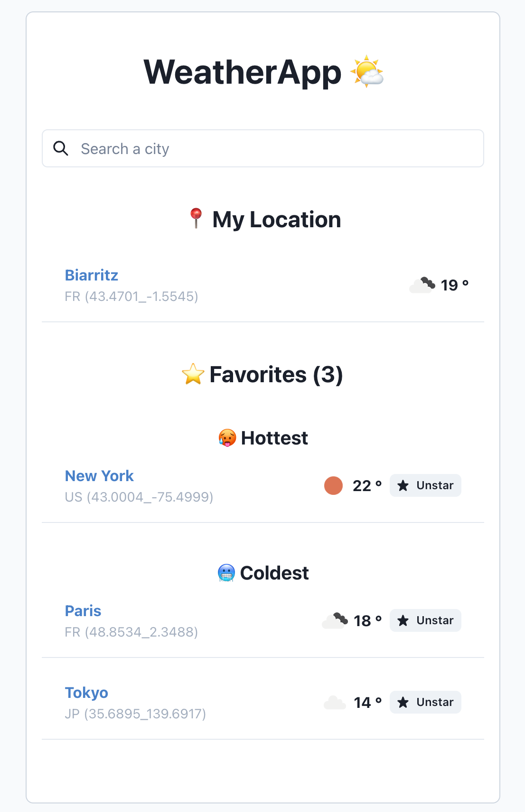

# [Weather](https://weather-jade-kappa.vercel.app/)

## Development

Create your own `.env.local` file and add the following variables :

```
OPENWEATHER_API_KEY=
OPENWEATHER_API_KEY_CITY=
```

Run the local server

```bash
yarn dev
```

Open [http://localhost:3000](http://localhost:3000) with your browser to see the result.

# Test

```bash
yarn test
```

## Demo

Check out the demo [here](https://weather-jade-kappa.vercel.app/)


